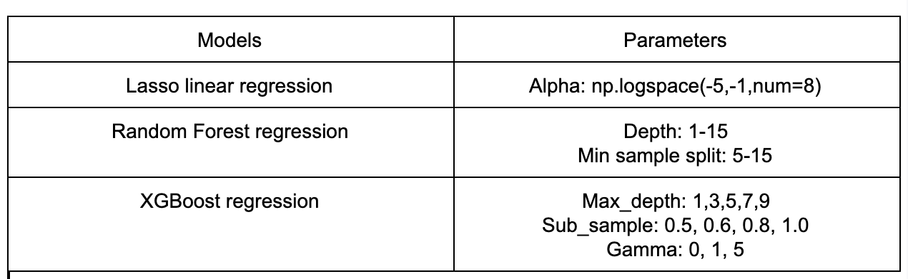
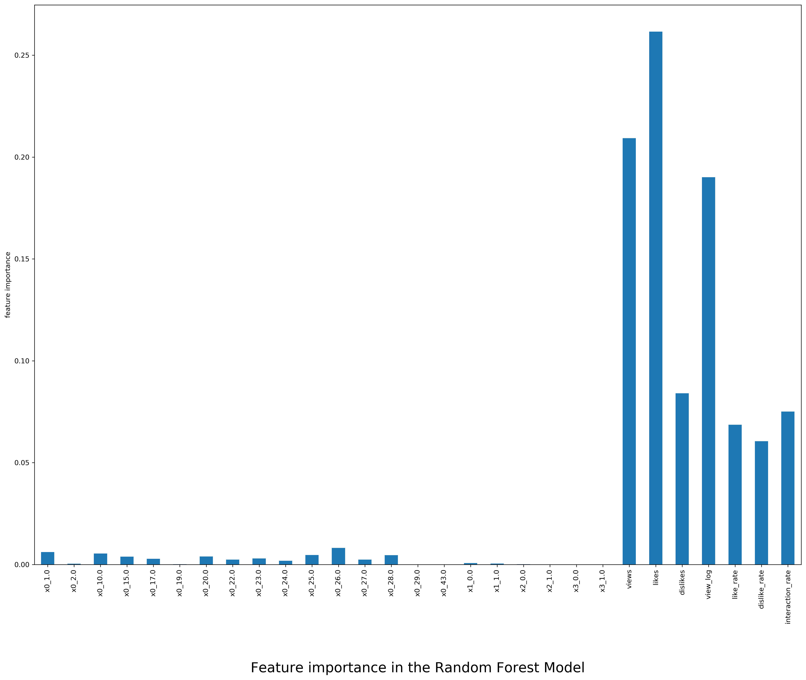

# YouTube Video Analysis
Tongxin Wang   
12/03/2019   
Brown University Data Science Inisitive   
[GitHub](https://github.com/tongxinw/YouTube_video_analysis)

## I. Introduction   
### Motivation:
YouTube is the world's largest video sharing platform and currently has 2 billion monthly active users, which accounts for 45% of the world's entire online population. As of 2018, there are more than 23 million YouTube channels, and Top-10 YOuTube channels earned $\$180.5$ billion between June 2017 and June 2018. PewDiePie alone has cleared at least $\$9$ million a year from advertising earning on his YouTube channel. Not only creating contents, these top YouTubers also have vast influences on their subscribers as well as the off-line world. YouTube is a website full of video contents along with tremendous market value. YouTube releases statistics of top 200 trending videos daily and the insights gained from these videos would be highly valuable for YouTubers as well as commercial users to improve their video performances to generate higher revenues.  

### Problem to solve:
In this project, we are aiming to predict the total trending days of certain videos based on their performances, such as views, comments, likes and dislikes. Thus, the target variable is the total trending days, which makes this machine learning project a regression problem.

### About the Data set:

Data set: [Trending YouTube Video Statistics](https://www.kaggle.com/datasnaek/youtube-new)

The data set contains daily record of the top 200 trending YouTube videos in the US, GB, DE, CA, and FR regions (USA, Great Britain, Germany, Canada, and France, respectively), and each country data is stored in a separate file. In this project we will focus on the US trending videos.    

Duration: 14 Nov 2017 - 14 June 2018 (205 days)   

This data set contains 40946 rows and 16 features, which are the following:    

- video_id(object): unique IDs for videos
- trending_date(object): the date of the trending list
- title(object): video title
- channel_title(object): channel title
- category_id(int64): IDs for categories
- publish_time(object): publish time for videos
- tags(object): the tags of videos
- views(int64): total number of views
- likes(int64): total number of likes
- dislikes(int64): total number of dislikes
- comment_count(int64): total number of comments
- thumbnail_link(object): link of the thumbnail
- comments_disabled(bool): whether the video disable comment or not
- ratings_disabled(bool): whether the video disable rating or not
- video_error_or_removed(bool):whether the video has an error or not
- description(object): descriptions for videos

In addition to provided features, we added several features for EDA and modeling, which are:   
- total_trending_days: counts the number of times a certain video appears on the treding list
- like_rate: $\frac{likes}{views}$
- dislike_rate: $\frac{dislikes}{views}$
- comment_log: $log(comment\_count)$
- view_log: $log(views)$
- interaction_rate: $\frac{likes + dislikes + 2 * comment\_count}{views} * 100$

### Previous research:

This dataset is retrieved from Kaggle and it contains data from several countries, such as UK, Canada, Mexico, Japan, South Korea, France. etc. People have been using these data in the following ways:
Sentiment analysis in a variety of forms
Categorising YouTube videos based on their comments and statistics.
Training ML algorithms like RNNs to generate their own YouTube comments.
Analysing what factors affect how popular a YouTube video will be.
Statistical analysis over time
There are more than 500 kennels about this dataset on the Kaggle website about the aforementioned topics, and these projects could be found [here](https://www.kaggle.com/datasnaek/youtube-new/kernels). 

## II. EDA   

In this section, we will analyse individual features. 

First of all, it would be interesting for us to see the videos with top number of views.   
From Figure 3.1, we can see that 8 out of 10 top viewed videos belong to the music genre. The video gains the most views between 11/14/2017 and 6/14/2018 is *Childish Gambino - This Is America (Official Video)*, and the number of its view is 225,211,923. The only two videos in the list which are not music are *YouTube Rewind: The Shape of 2017* and *Marvel Studios' Avengers: Infinity War Official*, and both of these two videos are entertainment. 

*Fig.3.1 : Top views Videos*

Figure 3.1 appears more interesting if we compare it to the Figure 3.2, which is Video counts by Category Names. 

*Fig.3.2 : video counts by categories*

As we can see from Figure 3.2, entertainment genre ranks Top 1 in the number of video counts by category names, and it takes 25.5%. The next four genres are Music, How to and Style, Comedy and News and Politics. The genres which have the least number of trending videos are NonProfits and Activism and Shows. 

Although entertainment genre has the most number of videos, music genre generates the most views. 

Besides number of views, interaction rate is also one of the most important features of trending videos. Interaction rate is related to views, comments, likes and dislikes. The detailed explanation of interaction rate will be discussed in the Method section.

In Figure 3.3, we can see the video with the highest interaction rate. 

*Fig.3.3 : videos with top interaction rates*

The top one is the music video Finesse (Remix) by Bruno Mars. The Top 10 videos with the highest interaction rates are from Music, Entertainment and How to and Style categories. Thus, we can see that although entertainment takes the most numbers of videos, it does not guarantee neither the most number of views nor the highest interaction rates. 

In Figure 3.4, we can see the number of views of videos by category names as well as the log(views) by category names. 

*Fig.3.4 : views distribution by categories*

As we can see from the figure, the average of log(views) are around 6 for most of the categories, and most of the categories have outliers. In the top figure, the outlier with the highest views is in the Music category, and the result matches Figure 3.1. 

Figure 3.5 is the histogram of total trending days for each videos. 

*Fig.3.5 : histogram of total trending days for each videos*

There are 6351 unique videos in the data set and the range of the total trending days are from 1 to 30. Most of the total trending days are less than 15, and the mean is 6.45 days. It is reasonable to have less videos with large total trending days, but it is also surprising to see that there is a drop of number of videos with 26 total trending days.

Figure 3.6: Correlation matrix of the data frame. 

*Fig.3.6 : Correlation matrix of the data frame*

After preprocessing, there are 29 feature columns in the data frame. We can see most of the feature are less correlated, but x1_0.0 and x1_1.0 are negatively correlated as x1 is a binary feature. X2 and x3 have the similar characteristics as x1. It also makes sense to see that views, likes, dislikes, like_rate, dislike_rate and interaction_rate are positively correlated. 

## III. Methods

To understand the relationships between total trending days video’s performance, we have to modify the data sets in the following ways. 

Package Versions: 

Python: 3.7.3  
sklearn: 0.21.3  
numpy: 1.17.1  
pandas: 0.25.0  
seaborn: 0.9.0  
matplotlib: 3.1.1

### Understanding Added Columns:

- We added total_trending_days by counting the number of times a certain video appears in the trending list.   

- We added like_rate, dislike_rate, log(comment) and log(views) for better analysis. As we can see from Figure 3.4, the range of views are high, and it performs poorly on box plot. Using log would reduce the range and produce a better box plot for analyzing.   

- We added interaction_rate to measure the interaction rate for each video. Due to more efforts are putting into comment(typing) than like/dislike(clicking buttons), the coefficient for comments is higher than likes and dislikes. I think 2 is a reasonable number, but there can be other choices. 

### Reducing rows:

- As we are analyzing the total trending days for each video, it is unnecessary to keep duplicate videos in the data set. Thus we removed all the duplicate videos and kept the ones which last appear on the trending list. This reduces the number of videos on the list from 40946 to 6351 unique videos. 

### Model training and Machine Learning Pipelines: 

The metric I used to evaluate all models’ performance is MSE as this is a regression problem. 

In Lasso, the uncertainty due to splitting is 0.22 +/- 0.02. In Random forest, the uncertainty due to splitting is 0.23 +/- 0.02. In XGBoost, the uncertainty due to splitting is 0.23 +/- 0.02. 

In general, while performing machine learning pipeline, we need to consider several important steps. First of all, regression problems use different models compared to classification problems. Thus, we can not use logistic regression for regression problems. Also, while training models, we encountered convergence waring, thus we need to take max_iteratin into consideration. Moreover, while tuning the parameters, we need to make sure the best parameter is at the edge of the range of parameters. 

## IV. Results

We can see that the R2 score for these three models are 0.22 +/- 0.02, 0.23 +/- 0.02 and 0.23 +/- 0.02, which means they are 11 standard deviation above the base line, 11.5 standard deviation above the base line, and 11.5 standard deviation above the base line. Thus, random forest and XGBoost performs better than Lasso regression. 

*Fig.3.7 : feature_importance for random forest*

We can see from the Figure 3.7, numerical features have higher feature importances than other categorical features. Number of likes is the feature contributes the most feature importance. 

## V. Outlook

If we could get more information on videos not only containing trending videos, we might be able to predict whether a video could be classified as a trending videos. Moreover, we could also analysis the text info contained in the data set, such as the title and the tag. It would be interesting to see whether the number of tags influences the number of views a video get or not. There are many things could be done if I have more data and advanced analysing techniques. 

## VI. References   
https://www.businessofapps.com/data/youtube-statistics/#1    
https://influencermarketinghub.com/pewdiepie-net-worth/  
https://www.kaggle.com/teezhiyao/ai-project/notebook#1.-Introduction
https://www.kaggle.com/datasnaek/youtube-new
